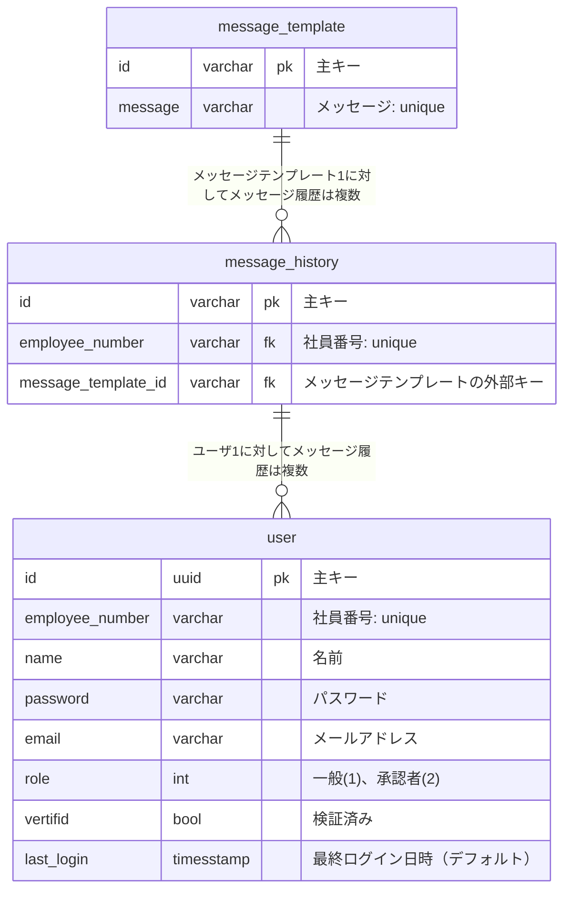

<!-- 
ER図
  editor起動コマンド:
    docker run --name mermaid_editor -d -p 9000:80 ghcr.io/mermaid-js/mermaid-live-editor
-->

```mermaid
erDiagram
    %% システムユーザ
    user{
        id uuid pk "主キー"
        employee_number varchar "社員番号: unique"
        name varchar "名前"
        password varchar "パスワード"
        email varchar "メールアドレス"
        role int "一般(1)、承認者(2)"
        vertifid bool "検証済み"
        last_login timesstamp "最終ログイン日時（デフォルト）"
    }

    %%メッセージ履歴
    message_history {
        id varchar pk "主キー"
        employee_number varchar fk "社員番号: unique"
        message_template_id varchar fk "メッセージテンプレートの外部キー"
    }

    %%メッセージテンプレート
    message_template {
        id varchar pk "主キー"
        message varchar "メッセージ: unique"
    }

    message_template ||--o{ message_history : "メッセージテンプレート1に対してメッセージ履歴は複数"
    message_history ||--o{ user : "ユーザ1に対してメッセージ履歴は複数"
```